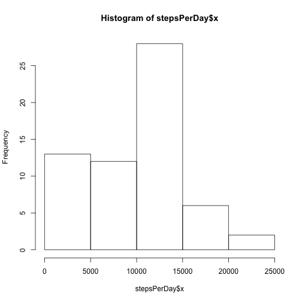
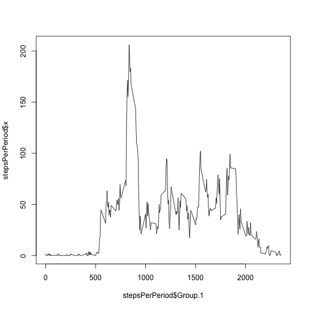
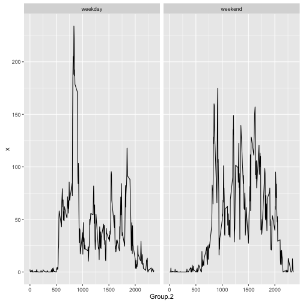

## Loading Data and Loading Packages


```r
library(ggplot2)

rawData <- read.csv("activity.csv")
```

## What is the mean total number of steps taken each day?


```r
stepsPerDay <- aggregate(rawData$steps, 
                         by = list(rawData$date), 
                         FUN = sum,
                         na.rm = TRUE)
hist(stepsPerDay$x)
```



```r
mean(stepsPerDay$x)
```

```
## [1] 9354.23
```

```r
median(stepsPerDay$x)
```

```
## [1] 10395
```

## What is the daily average activity pattern?


```r
stepsPerPeriod <- aggregate(rawData$steps,
                            by = list(rawData$interval),
                            FUN = mean,
                            na.rm = TRUE)

plot(stepsPerPeriod$Group.1, stepsPerPeriod$x, type = "l")
```



```r
stepsPerPeriod$Group.1[stepsPerPeriod$x == max(stepsPerPeriod$x)]
```

```
## [1] 835
```


## Imputing missing values


```r
imputedData <- rawData

names(stepsPerPeriod)[1] <- "interval"

imputedData <- merge(imputedData, stepsPerPeriod, by = "interval")

imputedData[is.na(imputedData$steps), 2] <- imputedData[is.na(imputedData$steps), 4]
```


## Are there differences in activity patterns between weekdays and weekends?


```r
rawData$weekDay <- as.factor(weekdays(as.Date(rawData$date)))

levels(rawData$weekDay) <- c("weekday", "weekday", "weekend", "weekend", "weekday", "weekday", "weekday")

weekdayPeriods <- aggregate(rawData$steps,
                            by = list(rawData$weekDay, rawData$interval),
                            FUN = mean,
                            na.rm = TRUE)

plt <- ggplot(weekdayPeriods, aes(Group.2, x)) + geom_line()
plt + facet_grid(. ~ Group.1)
```


